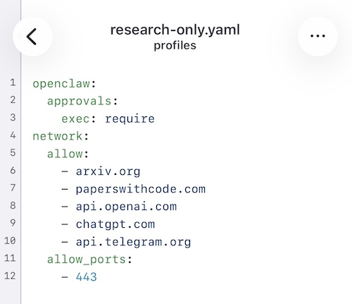
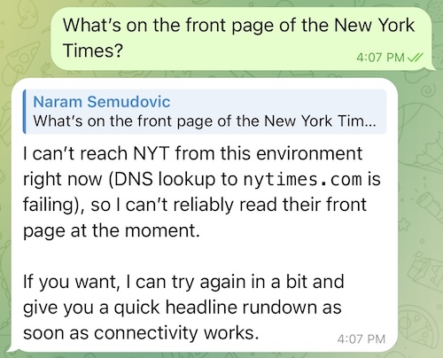
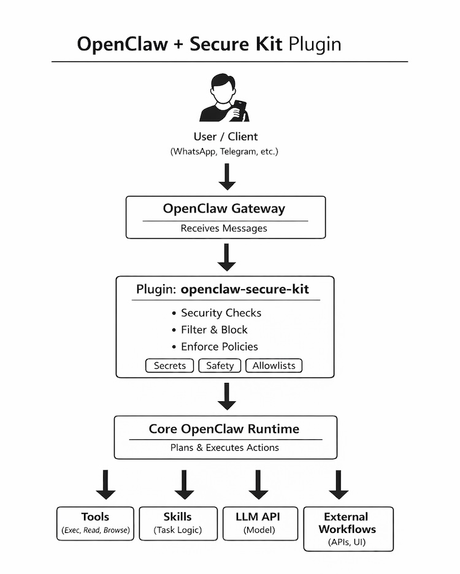

# openclaw-secure-kit

Secure-by-default, **profile-driven hardening** for running OpenClaw on Ubuntu with **verifiable egress controls**.

> This kit is designed to run **after** you have a host (Ubuntu + Docker), and **before** you start using OpenClaw in production.
> It generates a hardened, reproducible deployment under `out/<profile>/` and provides a one-command verifier that writes a security report.

---

## Need this deployed for your team?

This repo stays fully open-source. If you want a hardened OpenClaw environment set up quickly, I provide paid services:

- **Secure install (one-time)** from **$499**
- **Managed updates (monthly)** from **$299/mo**
- **Custom profiles / policy tuning** from **$1,500**

Contact:
- Email: `nino.skopac@gmail.com`
- Upwork: https://www.upwork.com/freelancers/~013469808662f577d0

Every paid engagement includes a verifier run and delivery of `security-report.md`.

---

## Table of contents
- [Services (hire me)](#services-hire-me)
- [Who this is for](#who-this-is-for)
- [Engagement workflow](#engagement-workflow)
- [Demo](#demo)
- [What you get](#what-you-get)
- [Quickstart](#quickstart)
- [How it works](#how-it-works)
- [Profiles](#profiles)
- [Verification (`ocs doctor`)](#verification-ocs-doctor)
- [Security model (and caveats)](#security-model-and-caveats)
- [Install / uninstall](#install--uninstall)
- [Troubleshooting](#troubleshooting)
- [Docs](#docs)
- [Contact](#contact)
- [Contributing](#contributing)
- [Security policy](#security-policy)

---

## Services (hire me)

Best for teams that want OpenClaw running on Ubuntu with security guardrails and a report they can hand to stakeholders.

- **Secure install (one-time)** — starting at **$499**
- **Managed updates (monthly)** — starting at **$299/mo**
- **Custom profiles / policy tuning** — starting at **$1,500**

What you get in paid scope:
- profile-driven deployment generation under `out/<profile>/`
- Docker Compose launch support on Ubuntu 22.04/24.04
- DNS allowlist + host firewall policy alignment
- verifier run (`ocs doctor`) and report handoff

Full scope and pricing: **[`docs/SERVICES.md`](docs/SERVICES.md)**

## Who this is for

- teams running OpenClaw in customer or internal production workflows
- founders who need a hardened baseline before delegating operations
- operators who need repeatable checks and a shareable security report

## Engagement workflow

1. **Intake**: you share host details, use case, and required allowlist domains.
2. **Implementation**: I deploy/tune profiles and produce `out/<profile>/` artifacts.
3. **Verification**: we run `ocs doctor` and review `security-report.md` together.
4. **Handoff or managed ops**: one-time delivery or monthly maintenance.

## Demo
### Install

### Config

### Approved

### Rejected



## What you get

- **Profile-driven output** under `out/<profile>/`
  - externalized secrets (tokens live in `.env`, not baked into compose)
  - pinned image tags (no `latest`)
- **Egress guardrails**
  - DNS allowlist policy + host firewall controls
- **Loopback-first exposure**
  - gateway binds to `127.0.0.1` by default (not publicly exposed)
- **Non-root runtime**
  - `openclaw-gateway` runs as `1000:1000` (`node` user)
- **One-command verification**
  - `ocs doctor` produces a repeatable `security-report.md` with PASS/WARN/FAIL summary

---

## Quickstart

> **Why `sudo`?** The installer configures host dependencies and security controls (systemd / nftables) and installs to `/opt`, which requires root on Ubuntu.

```bash
git clone https://github.com/NinoSkopac/openclaw-secure-kit
cd openclaw-secure-kit
chmod +x install.sh

sudo ./install.sh

# Generate a hardened deployment under out/<profile>/
ocs install --profile research-only

# Start the generated stack
docker compose -f out/research-only/docker-compose.yml --env-file out/research-only/.env up -d

# Verify host + runtime controls and write reports
sudo ocs doctor --profile research-only

# Read the security checks report
cat out/research-only/security-report.md

# Optional: read the preflight/orchestration report
cat out/research-only/doctor-report.md
```

Notes:

- The generated `research-only` profile is **non-interactive by default** (no manual “setup” step required).
- To avoid fresh-install bind-mount permission issues, runtime dirs:
  - `/home/node/.openclaw/canvas`
  - `/home/node/.openclaw/cron`
    are mounted as **tmpfs overlays (ephemeral)**.

---

## How it works

1. You choose a **profile** (example: `research-only`).
2. `ocs install` generates a hardened deployment bundle under:

   ```
   out/<profile>/
     .env
     docker-compose.yml
     security-report.md   (security checks from doctor)
     doctor-report.md     (doctor preflight + orchestration checks)
   ```

3. You run Docker Compose using the generated `.env` + compose file.
4. `ocs doctor` verifies the host and runtime posture and writes a report you can hand to:
  - teammates
  - clients
  - compliance/security reviewers

### Architecture


---

## Profiles

Profiles are intended to be **simple, auditable, and repeatable**.

- Start with an existing profile (e.g. `research-only`)
- Create additional profiles when you need different allowlists, exposure, or policy posture
- Output is always generated under `out/<profile>/` so you can diff/commit internally if you want

Tip: if ports `18789/18790` are already in use, `ocs install` will auto-select free ports and write them into `out/<profile>/.env`. Always check the generated `.env` before connecting clients.

---

## Verification (`ocs doctor`)

`ocs doctor` is the “trust but verify” step.

```bash
sudo ocs doctor --profile research-only --verbose
```

It writes:

- `out/<profile>/security-report.md` (security checks)
- `out/<profile>/doctor-report.md` (doctor preflight/orchestration checks)

And prints a summary like:

```text
Wrote doctor report to out/research-only/doctor-report.md
Wrote security report to out/research-only/security-report.md
DOCTOR:   PASS: 10  WARN: 1  FAIL: 0
SECURITY: PASS: 11  WARN: 1  FAIL: 0
```

If `doctor` reports any **FAIL**, treat the host as **not compliant** until fixed.

### Strict IP egress check (optional)

DNS allowlisting controls domain resolution, but it **cannot** block direct HTTPS connections to raw IPs by itself.

- Default policy: `network.direct_ip_policy: warn`
- Strict policy: `network.direct_ip_policy: fail` (or `network.strict_ip_egress: true`)
- One-off strict run:

```bash
sudo ocs doctor --profile research-only --strict-ip-egress
```

---

## Security model and caveats

### What v1 focuses on

- domain-level egress control (DNS allowlist + host firewall)
- loopback-first gateway exposure (not public by default)
- non-root containers
- secrets externalized (`OPENCLAW_GATEWAY_TOKEN` stays in `.env`)
- pinned image tags (no `latest`)

### What v1 does **not** guarantee

This is **not** an “impossible-bypass” outbound control model.

**Direct-to-IP HTTPS may still work** (example: `https://1.1.1.1`) even when non-allowlisted domains are blocked by DNS policy.
Do not claim v1 makes egress bypass impossible.

### Assumptions

- end-users do **not** have SSH access to the host
- workloads do **not** mount the Docker socket
- deployment target is Ubuntu 22.04/24.04 with Docker

See the threat model doc for guarantees, assumptions, limitations, and hardening roadmap.

---

## Install / uninstall

### Install

```bash
chmod +x install.sh
sudo ./install.sh
```

Common options:

```bash
sudo ./install.sh --dry-run
sudo ./install.sh --no-deps
sudo ./install.sh --prefix /srv/openclaw-secure-kit
sudo ./install.sh --force
sudo ./install.sh --version
```

### Curl | bash

```bash
curl -fsSL https://raw.githubusercontent.com/NinoSkopac/openclaw-secure-kit/refs/heads/main/install.sh | bash
```

### Uninstall

```bash
sudo ./uninstall.sh
sudo ./uninstall.sh --purge
sudo ./uninstall.sh --purge --prefix /srv/openclaw-secure-kit
```

By default, `uninstall.sh` also tears down generated compose stacks found under `out/*/docker-compose.yml`.
Use `./uninstall.sh --no-down` to skip stack teardown.

---

## Troubleshooting

### “I don’t see tmpfs mounts in `docker inspect ... .Mounts`”
tmpfs entries don’t show up under `.Mounts`. Inspect `.HostConfig.Tmpfs` instead:

```bash
cd out/research-only
CID="$(docker compose --env-file .env ps -q openclaw-gateway)"
docker inspect "$CID" --format '{{json .HostConfig.Tmpfs}}' | jq .
docker compose --env-file .env exec openclaw-gateway sh -lc 'mount | rg openclaw'
```

### Port collisions
If ports are busy, `ocs install` auto-selects new ones. Verify:

```bash
cat out/research-only/.env | rg 'OPENCLAW_.*PORT'
```

### “Doctor results differ when not using sudo”
Run doctor with `sudo` for reliable host/runtime checks:

```bash
sudo ocs doctor --profile research-only --verbose
```

---

## Docs

- Services: [`docs/SERVICES.md`](docs/SERVICES.md)
- Threat model: [`docs/THREAT_MODEL.md`](docs/THREAT_MODEL.md)
- Quickstart: [`docs/QUICKSTART.md`](docs/QUICKSTART.md)
- Install guide: [`docs/INSTALL.md`](docs/INSTALL.md)
- Hardening notes: [`docs/HARDENING.md`](docs/HARDENING.md)
- Public release checklist: [`docs/PUBLIC_RELEASE_CHECKLIST.md`](docs/PUBLIC_RELEASE_CHECKLIST.md)

---

## Contact

- Email: `nino.skopac@gmail.com`
- Upwork: https://www.upwork.com/freelancers/~013469808662f577d0
- Service scope and pricing: [`docs/SERVICES.md`](docs/SERVICES.md)

---

## Contributing

PRs welcome. See `CONTRIBUTING.md`.

---

## Security policy

Please report security issues privately. See `SECURITY.md`.
